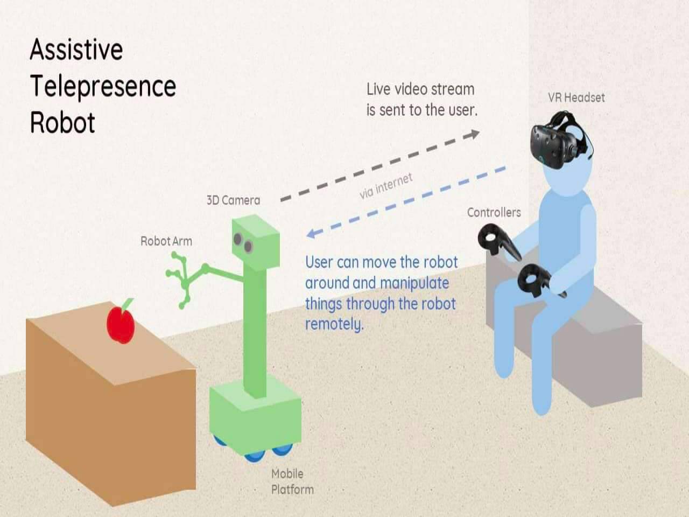

# VR-TELE #
A realization of 3D Telepresence 

## Description ##

*<br/>[Project Link](https://engfac.cooper.edu/nshlayan/692)*
## Functionality ##
* Online surveillance 
* Motion detection and 
* VR view of Pi-video stream

## Dependencies ##
* JVM
* Python
* make
* Leapmotion open-source Library

## Compilation and Usage ##
* [Installation guide](src/README.md)


## Compilation and Usage on Pi ##
* Step 1: Install Raspbian on your RPi
* Step 2: Attach camera to RPi and enable camera support, [further info] (http://www.raspberrypi.org/camera).
* Step 3: Update your RPi with the following commands:
```bash
sudo apt-get update
sudo apt-get dist-upgrade
```
Occasionally if camera core software updates have been done then a sudo rpi-update may be used to benefit from these before they become available as standard.

* Step 4:

For Jessie Lite run 

```bash
sudo apt-get install git
```

Clone the code from github and enable and run the install script with the following commands:

```bash
git clone git clone https://github.com/zhekaijin/PI_Camera_Interface.git
cd RPi_Cam_Web_Interface
./install.sh
```
*Please refer to [RPi_Cam_Web_Interface](https://github.com/ZhekaiJin/PI_Camera_Interface) module for further web dev 

## Acknowledgments
* Thanks for the mentorship and support from our principal investigator **Dr. Neveen Shlayan**.

## Versioning
This work use [SemVer](http://semver.org/) for versioning. This repo now contains version 1.0.

## Authors
**[Zhekai Jin](https://zhekaijin.github.io/)**, **Simon Shao**.

## Affiliated Lab
[Sustainable, Mobile, & Agile Connected Communities Lab](https://engfac.cooper.edu/nshlayan/689)
